# 📊 Superstore SQL Analysis

## 📌 Project Overview
This project analyzes the **Superstore Dataset** using **SQL Server**.
The aim is to derive meaningful business insights with **advanced SQL queries** such as:
- Total Sales & Profit trends
- Top & second-highest performing products
- Customer purchase behavior
- Shipping performance

---

## 🗂 Repository Structure
```
├── datasets/   # Superstore source data
├── queries/    # All SQL queries used for analysis
├── images/     # Query output screenshots
└── README.md
```

---

## 🗃 Dataset
Dataset Source: [Superstore Dataset (Kaggle)](https://www.kaggle.com/datasets/vivek468/superstore-dataset-final)

Local copy: [`datasets/Superstore.csv`](datasets/Superstore.csv)

---

## 📂 Files
- [Analysis.sql](queries/Analysis.sql) → All queries used for analysis

---

## 📷 Query Outputs
**1️⃣ Total Sales & Profit by Category** 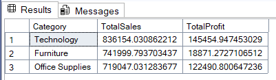
**2️⃣ Top 5 Customers by Total Profit** 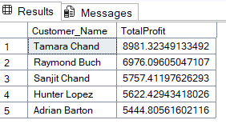
**3️⃣ Monthly Sales Trend** 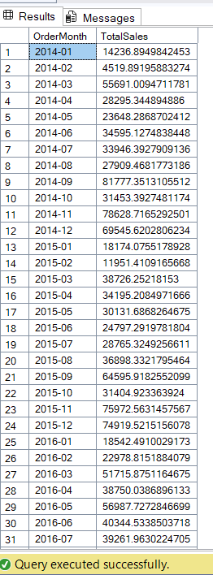
**4️⃣ Profit by Region** 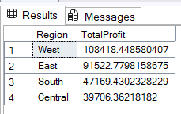
**5️⃣ Top 5 Products by Quantity Sold** 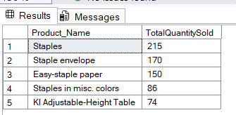
**6️⃣ Top 5 Customers by Highest Total Sales** 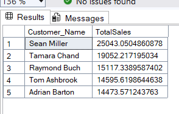
**7️⃣ Monthly Sales Trend (with Profit)** 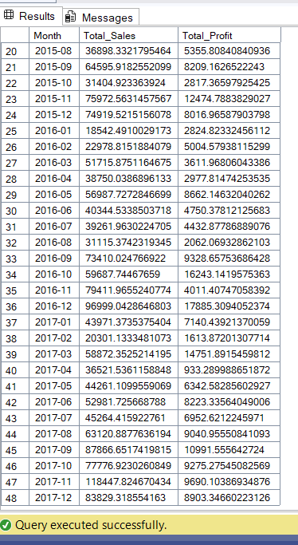
**8️⃣ Year-over-Year (YoY) Growth in Sales** 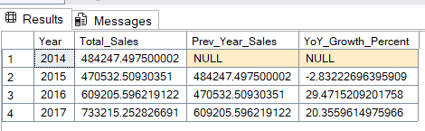
**9️⃣ Top 5 Profitable Products** 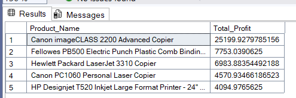
**🔟 Loss-Making Products** 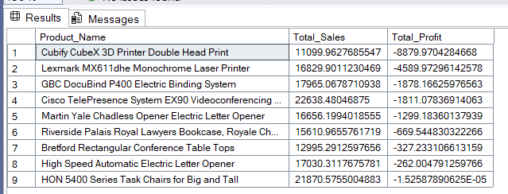
**1️⃣1️⃣ Regional Performance with Ranking** 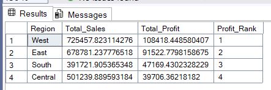
**1️⃣2️⃣ Customer Segmentation** 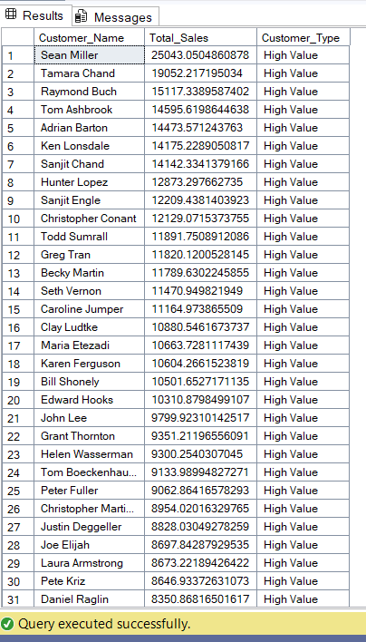
**1️⃣3️⃣ Shipping Speed Impact on Profit** 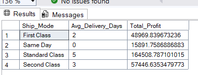
**1️⃣4️⃣ Top 3 Customers in Each Region** 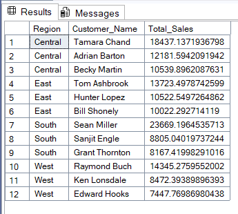
**1️⃣5️⃣ Second Highest Sales per Region** 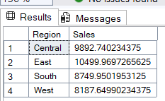
**1️⃣6️⃣ Second Highest Product by Total Sales** 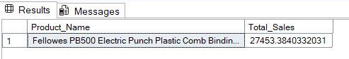

---

## 🔑 Key SQL Concepts Used
- **CTEs & Subqueries** – reusable query blocks
- **Window Functions** – RANK, DENSE_RANK, LAG
- **Aggregations** – SUM, COUNT, AVG, GROUP BY
- **Joins** – combining multiple tables
- **Filtering & Sorting** – advanced WHERE + ORDER BY
